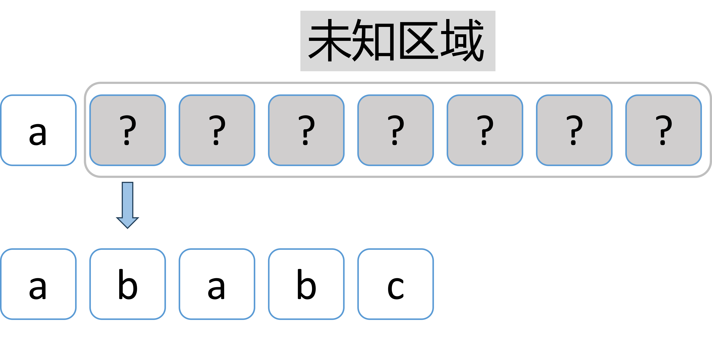
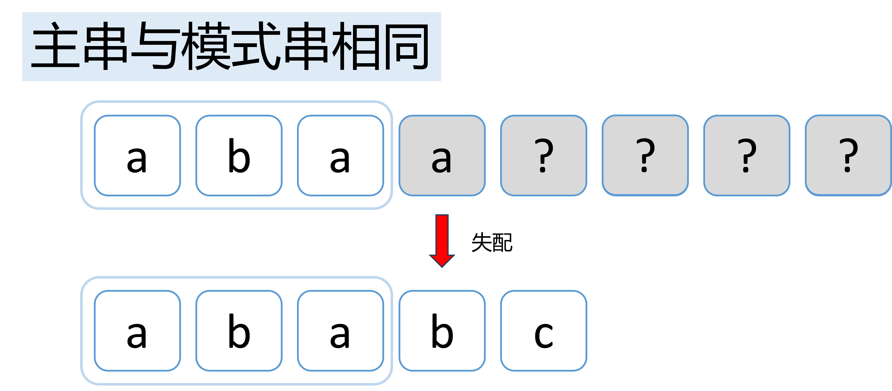

# KMP算法思路详解

---

## 目录


- [KMP算法思路详解](#kmp算法思路详解)
  - [目录](#目录)
- [KMP算法思路详解](#kmp算法思路详解-1)
  - [一 朴素模式匹配算法](#一-朴素模式匹配算法)
    - [朴素模式匹配算法原理](#朴素模式匹配算法原理)
    - [时间复杂度:](#时间复杂度)
    - [代码实现](#代码实现)
  - [二 朴素模式匹配算法的优化：KMP算法的思想](#二-朴素模式匹配算法的优化kmp算法的思想)
    - [从另外一个角度来观察一下朴素模式匹配算法](#从另外一个角度来观察一下朴素模式匹配算法)
    - [KMP算法的主要思想](#kmp算法的主要思想)
  - [三 KMP算法代码实现](#三-kmp算法代码实现)
    - [next数组](#next数组)
    - [KMP算法实现](#kmp算法实现)
  - [四 更进一步优化KMP算法及其代码](#四-更进一步优化kmp算法及其代码)
    - [nextval数组优化](#nextval数组优化)

---

# KMP算法思路详解
---
本仓库使用Visual Studio 2022创建C++项目，利用C++模板实现各种数据结构类型。

GitHub仓库地址：[CppDataStructure_2025](https://github.com/mshylf/CppDataStructure_2025)

国内镜像仓库地址：[CppDataStructure_2025](https://gitcode.com/2404_89567743/CppDataStructure_2025)

---

## 一 朴素模式匹配算法
在字符串处理中，模式匹配将子串在主串中的位置返回。朴素模式匹配算法（Naive String Matching Algorithm）是最基础且直观的一种方法。

### 朴素模式匹配算法原理
朴素模式匹配算法的基本思想是：
1. 从主串的起始位置开始，逐字符比较主串和模式串。
2. 如果某一位匹配失败，则<mark>**回退主串指针**</mark>，重新从下一个位置开始比较。
3. 重复上述过程，直到找到匹配或遍历完主串。

<br>
<div align="center" style="margin: -50px 0 -50px 0">

</div>

### 时间复杂度:
- 平均情况下，时间复杂度接近 \(O(m*n)\)。

### 代码实现
以下是基于C++的朴素模式匹配算法实现：

```cpp
#include <cstring>
#include <iostream>

// 通用朴素模式匹配算法
int strFind_normal(const char *mainStr, const char *pattern) {
    // 边界检查
    if (!mainStr || !pattern) {
        return -1; // 输入为空，返回-1表示未找到
    }

    int mainLen = strlen(mainStr); // 主串长度
    int patternLen = strlen(pattern); // 模式串长度

    // 如果模式串为空，约定匹配成功，返回0
    if (patternLen == 0) {
        return 0;
    }

    // 如果模式串比主串长，不可能匹配
    if (patternLen > mainLen) {
        return -1;
    }

    // 遍历主串
    for (int i = 0; i <= mainLen - patternLen; ++i) {
        int j = 0;
        // 比较模式串
        while (j < patternLen && mainStr[i + j] == pattern[j]) {
            ++j;
        }
        // 如果模式串完全匹配
        if (j == patternLen) {
            return i; // 返回匹配的起始位置
        }
    }
    return -1; // 未找到匹配
}
```

## 二 朴素模式匹配算法的优化：KMP算法的思想
> 注：思路参考[王道考研数据结构](https://www.bilibili.com/video/BV1b7411N798/?p=38&share_source=copy_web&vd_source=ab17110524dd23a5a7f15cb4c10cfde1)

### 从另外一个角度来观察一下朴素模式匹配算法

如果当前尝试匹配的这个子串在某一个位置匹配失败了，那么我们就会**返回**到主串的下一个位置与子串的开头位置尝试着往后匹配。如下图中，匹配从1位置开始，在4位置失配，主串则返回2位置，子串返回开头进行下一次匹配。
<!-- 整体容器 -->
<div style="margin: -50px 0 15px 0">
    <!-- GIF展示区 -->
    <div style="margin: -20px 0 -50px 0">
        <div align="center">
            
        </div>
    </div>
    <!-- 双图对比区 -->
    <div style="display: flex; gap: 20px; justify-content: center; align-items: center;">
        <div style="flex: 0 1 45%;padding: 5px;">
            
        </div>
        <div style="flex: 0 1 45%;padding: 5px;">
            
        </div>
    </div>
</div><br>
为什么会从2号位置匹配呢，是因为对我们来说，主串中的字符到底是什么对我们是未知的，因此只能返回2号位置进行匹配。这样会导致主串反复的进行回溯，匹配效率低下。

<br>
<div align="center">

</div>
<br>
现在我们换一种思路，将刚才的过程再次梳理。当匹配到最后一个字符匹配失败时，主串中前边已经匹配过的字符一定是和模式串对应的。也就是说，对于刚刚已经扫描过的主串的一部分信息我们已经可以得知了。是否可以将其进行利用呢？

<br>
<div align="center">

</div>
<br>
在朴素模式匹配中，主串4位置失配后会继续匹配主串2位置的字符，显然会失配。之后会从3位置匹配，3位置匹配之后会继续扫描至4位置进行匹配。
<br>
<div align="center" style="margin: 0px 0 -50px 0">

</div>
但在我们知道了主串与模式串相同的这部分信息后，事情发生了改变。

<br>
失配时主串指针在4的位置，失配后第一次匹配显然失败，第二次匹配成功，现在主串与子串指针来到了下图位置，继续匹配之后的子串即可。所以我们可以利用已知的信息直接从失配状态跳转到下图所示的状态。

<br>
<div align="center">

</div>

另一个例子：

<div style="display: flex; 
            gap: 25px; 
            justify-content: center;
            margin: 30px 0;">
    <div style="flex: 1; max-width: 45%;">
        
    </div>
    <div style="flex: 1; max-width: 45%;">
        
    </div>
</div>

### KMP算法的主要思想
在以上两个示例中可以发现：

<br>

1. **主串的指针i在失配后并没有变化**，不需要再像朴素模式匹配算法中一样需要回溯了。
2. **前后缀相同**
   > 前缀：除最后一个字符外，所有以第一个字符开头的连续子串
   >
   >如字符串"ababa"前缀："a", "ab", "aba", "abab"
   >
   > 后缀：除第一个字符外，所有以最后一个字符结尾的连续子串
   >
   >如字符串"ababa"后缀："a", "ba", "aba", "baba"

   > 最长公共前后缀：同时满足前缀和后缀条件的最大长度子串

    以上两例中最长公共前后缀分别如下图：
<br>

<div style="display: flex; gap: 10px; justify-content: center;">
    <div style="flex: 1; max-width: 45%;">
        
    </div>
    <div style="flex: 1; max-width: 45%;">
        
    </div>
</div>

3. **只依赖于模式串**

     主串里边的这些字符信息虽然刚开始我们不得而知里边包含了哪些字符，但是通过模式串的部分匹配。我们可以确定主串里边前边这几个字符到底是什么，因此这部分信息并不依赖于主串，只和模式串有关。因此我们只需要研究模式串即可。
4. **只移动了j指针**
   
    我们可以发现，j指针指向的下标就是其前一个元素的最长公共前后缀的长度（数组从0开始）。又因为已知信息仅依赖于模式串，我们可以用一个数组来记录下当前元素失配时j指针应该跳转的下标，我们将其称为next数组！
5. **next数组**
   
    我们使用next数组记录模式串失配时模式串指针应该跳转的位置，本质就是记录了模式串每个位置前一个元素的最长公共前后缀长度，我们规定next[0]=-1！
    > 注：nextval数组在之后会介绍

| "ababc"                 | 0 | 1 | 2 | 3 | 4 |
|:-------:|:----:|:--------:|:------------------:|:--------------:|:---------------:|
| **字符**             | a     | b     | a     | b     | c     |
| **子字符串**         | a     | ab    | aba   | abab  | ababc |
| **最长公共前后缀长度** | 0     | 0     | 1     | 2     | 0     |
| **next数组**    | -1    | 0     | 0     | 1     | 2     |
| **优化nextval数组**   | -1    | 0     | -1    | 0     | 2     |

| "abaabc"                 | 0 | 1 | 2 | 3 | 4 | 5 |
|:----------------------:|:-------:|:-------:|:-------:|:-------:|:-------:|:-------:|
| **字符**             | a     | b     | a     | a     | b     | c     |
| **子字符串**         | a     | ab    | aba   | abaa  | abaab | abaabc|
| **最长公共前后缀长度** | 0     | 0     | 1     | 1     | 2     | 0     |
| **next数组**    | -1    | 0     | 0     | 1     | 1     | 2     |
| **优化nextval数组**   | -1    | 0     | -1    | -1    | 1     | 2     |

以上思想就是KMP算法的主要思想，它使得主串指针不需再进行回溯，仅扫描一遍即可找出子串位置。由于在实际问题中往往主串的长度远远大于模式串的长度，因此该算法将时间复杂度从 \(O(m*n)\) 提升至 \(O(m+n)\)。

## 三 KMP算法代码实现
### next数组
### KMP算法实现
## 四 更进一步优化KMP算法及其代码
### nextval数组优化